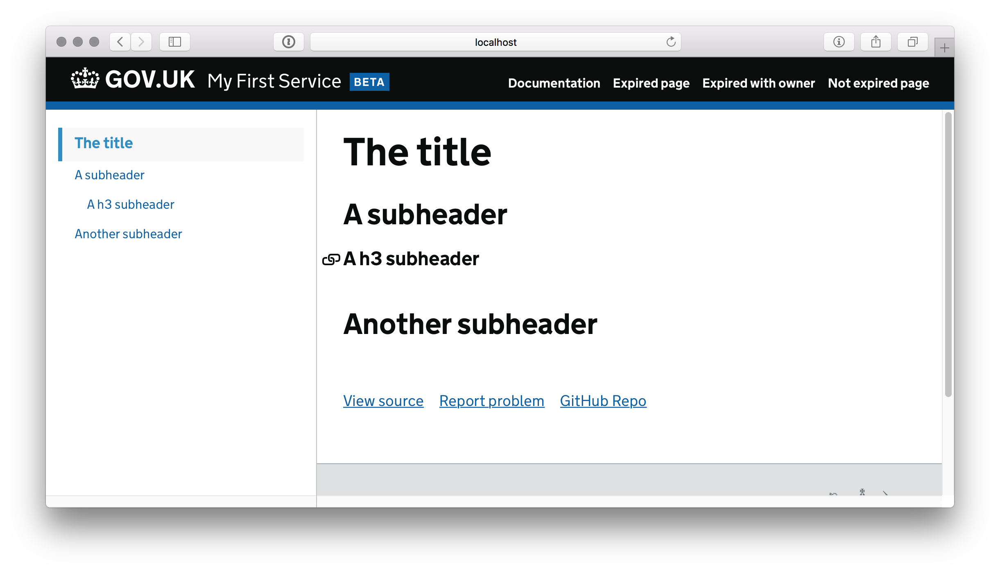

# Available frontmatter

"Frontmatter" allows page-specific variables to be included at the top of a template using YAML. For a general introduction on frontmatter, see the [Middleman frontmatter docs][mm].

## `last_reviewed_on` and `review_in`

These attributes determine the date when the page needs to be reviewed next.

If the page doesn't need to be reviewed, we show a blue box with the last-reviewed date, when it needs review again, and the owner.


If the page needs to be reviewed, we show a red box saying the page might not be accurate.


Example:

```yaml
---
last_reviewed_on: 2018-01-18
review_in: 6 weeks
---
```

You can use this in combination with [owner_slack](#owner-slack) to set an owner for the page.

## `layout`

The layout of the page.

```yaml
---
layout: core
---
```

There are 2 available page layouts.

### The `layout` layout (default)

By default, pages will use the `layout` layout. This layout will parse the page and generate a sidebar with a table of contents consisting of each `h2`, `h3`, `h4` heading.

```md
---
layout: layout
---

# The title

## A subheader

### A h3 subheader

## Another subheader
```

Will generate a page with the headings from the content in the sidebar.



### `core` layout

If you want more control about the layout, use `core` layout. This allows you to specify the sidebar manually with a `content_for` block.

```rb
---
layout: core
---

<% content_for :sidebar do %>
  You can put anything in the sidebar.
<% end %>

This page has a configurable sidebar that is independent of the content.
```


## `old_paths`

Any paths of pages that should redirect to this page.

Example:

```yaml
---
old_paths:
  - /some-old-page.html
---
```

## `owner_slack`

The Slack username or channel of the page owner. This can be used to appoint an individual or team as responsible for keeping the page up to date.

```yaml
---
owner_slack: "#operations-teams"
---
```

## `title`

The browser title of the page.

```yaml
---
title: My beautiful page
---
```

## `parent`

The page that should be highlighted as ‘active’ in the navigation.

```yaml
---
parent: shaving-yaks.html
---
```

[mm]: https://middlemanapp.com/basics/frontmatter
