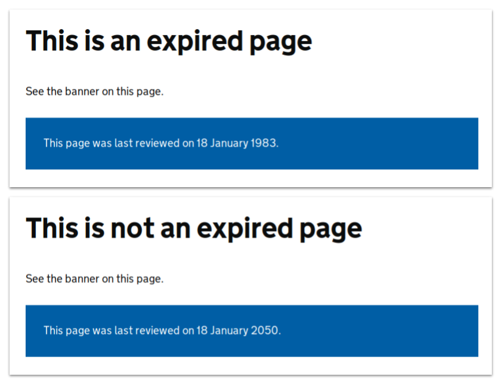

# Page Expiry and Review Notices

It's possible to include frontmatter configuration for a page to set an
expiration date for a piece of content. The expiration date is calculated using the `last_reviewed_on` and `review_in` frontmatter configuration parameters.

The `show_expiry` parameter in the global configuration file decides if the banners at the bottom of the page say that the page is expired or not.

For `show_expiry: true`, the banner at the bottom turns red if it's past the expiration date.

If the page doesn't need to be reviewed, we show a blue box with the
last-reviewed date, when it needs review again, and the owner.


If the page needs to be reviewed, we show a red box saying the page might not
be accurate.


Setting `show_expiry: false` generates a blue banner with the last reviewed date. This banner stays the same whether the page needs to be reviewed or not.  The banner does not mention when the page needs to be reviewed next or who the owner is.



This feature relies on JavaScript being enabled on the user's browser to
display the relevant notices.

If you want to disable the banners, but keep the review dates in the frontmatter, add the following to `source/javascripts/application.js`

```js
// Disable page expiry banner
window.GOVUK.Modules.PageExpiry = null;
```

For example if you do not want any page expiry banner at the bottom of the page, but want to have the review dates in the frontmatter for Daniel the Manual Spaniel to pick up.

## Frontmatter configuration

### `last_reviewed_on` and `review_in`

These attributes determine the date when the page needs to be reviewed next.

```yaml
---
last_reviewed_on: 2018-01-18
review_in: 6 weeks
---
```

You can use this in combination with `owner_slack` or `default_owner_slack` to
set an owner for the page.

### `owner_slack`

The Slack username or channel of the page owner. This can be used to appoint an
individual or team as responsible for keeping the page up to date.


## Global configuration

### `owner_slack_workspace`

The Slack workspace name used when linking to the Slack owner of a piece of
content. If not provided, the owner of a piece of content (channel or user)
won't be linked.

```yaml
owner_slack_workspace: gds
```

### `default_owner_slack`

The default Slack user or channel name to show as the owner of a piece of
content. Can be overridden using the `owner_slack` frontmatter config option.

```yaml
default_owner_slack: '#owner'
```


## Page API

The expiry date for each page is also shown in the `/api/pages.json`
representation of all pages.  This is used by the
[tech-docs-notifier](https://github.com/alphagov/tech-docs-notifier) to post
messages to Slack when pages have expired.
